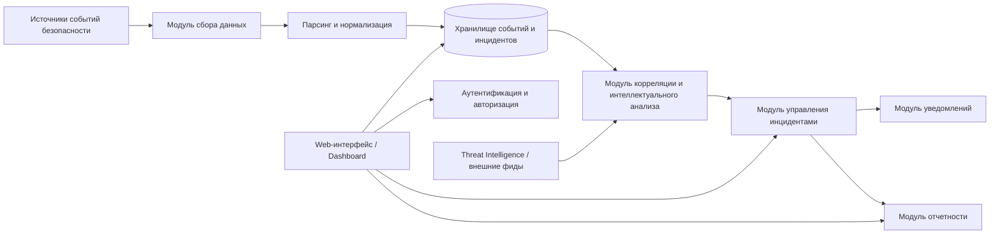
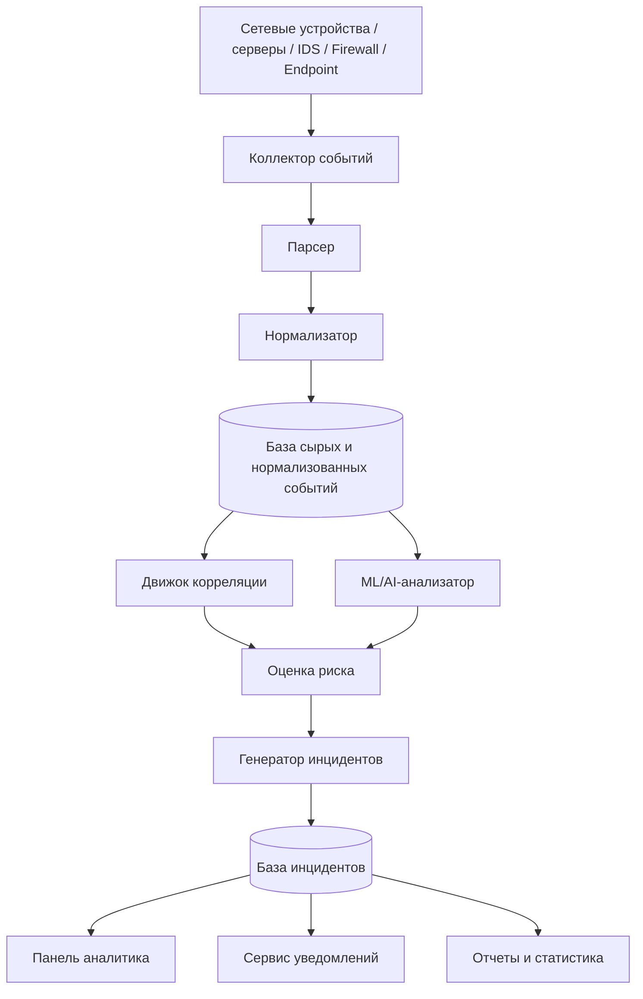
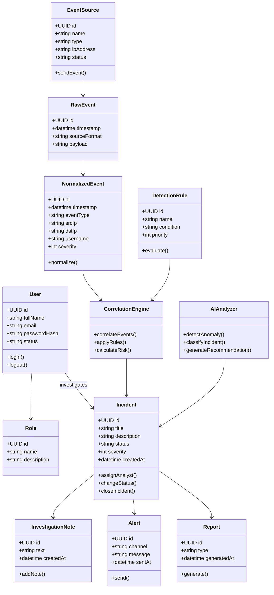

# Software Design Specification
## Система интеллектуального мониторинга и анализа инцидентов информационной безопасности

---

## 1. Введение

### 1.1. Назначение документа
Данный документ описывает начальную архитектуру проекта «Система интеллектуального мониторинга и анализа инцидентов информационной безопасности». В документе представлены основные компоненты системы, принципы их взаимодействия, ключевые сущности, а также архитектурные диаграммы.

### 1.2. Цель проекта
Цель проекта — разработка системы, которая автоматически собирает события информационной безопасности из различных источников, анализирует их с использованием правил и интеллектуальных методов, выявляет подозрительные активности, формирует инциденты, уведомляет специалистов и поддерживает процесс расследования.

### 1.3. Задачи системы
Система должна решать следующие задачи:
- сбор журналов и событий безопасности из различных источников;
- нормализация и хранение полученных данных;
- корреляция событий и выявление аномалий;
- формирование карточек инцидентов;
- приоритизация инцидентов по уровню критичности;
- уведомление ответственных сотрудников;
- поддержка анализа, расследования и закрытия инцидентов;
- ведение истории действий и отчетности.

---

## 2. Предметная область

Система используется в сфере информационной безопасности для мониторинга состояния защищаемой инфраструктуры и реагирования на инциденты. В качестве источников данных могут выступать:
- сетевые устройства;
- межсетевые экраны;
- IDS/IPS;
- серверы и рабочие станции;
- антивирусные системы;
- системы аутентификации;
- облачные сервисы;
- внешние источники threat intelligence.

Система ориентирована на использование специалистами SOC (Security Operations Center), администраторами безопасности и руководителями ИБ.

---

## 3. Пользователи системы

### 3.1. Аналитик ИБ
Функции:
- просмотр потока событий;
- анализ инцидентов;
- расследование;
- изменение статусов инцидентов;
- формирование отчетов.

### 3.2. Администратор системы
Функции:
- настройка источников данных;
- управление пользователями и ролями;
- настройка правил корреляции;
- настройка уведомлений;
- управление интеграциями.

### 3.3. Руководитель / Менеджер ИБ
Функции:
- просмотр сводной информации;
- контроль критических инцидентов;
- анализ отчетности;
- просмотр KPI и статистики.

---

## 4. Общая архитектурная идея

Система строится по модульной клиент-серверной архитектуре с элементами событийной обработки.

Основные уровни архитектуры:
1. **Уровень источников данных** — системы, генерирующие события безопасности.
2. **Уровень сбора и приема данных** — агенты, коллекторы, API-интеграции.
3. **Уровень обработки данных** — парсинг, нормализация, фильтрация, обогащение.
4. **Уровень интеллектуального анализа** — корреляция, детектирование аномалий, расчет риска.
5. **Уровень управления инцидентами** — создание, назначение, изменение статусов, расследование.
6. **Уровень представления** — веб-интерфейс, панель мониторинга, отчеты.
7. **Уровень уведомлений и интеграций** — email, мессенджеры, внешние API.

Архитектура должна поддерживать:
- масштабируемость по объему событий;
- расширяемость за счет новых источников и правил;
- безопасное хранение и обработку данных;
- журналирование и аудит действий пользователей.

---

## 5. Основные модули системы

### 5.1. Модуль сбора данных
Отвечает за получение событий из внешних источников:
- syslog;
- REST API;
- файловые логи;
- агенты на хостах;
- очереди сообщений.

### 5.2. Модуль парсинга и нормализации
Преобразует события разных форматов к единой внутренней модели.

Функции:
- разбор входных логов;
- выделение полей;
- нормализация структуры;
- приведение временных меток, IP-адресов, идентификаторов пользователей.

### 5.3. Модуль хранения данных
Обеспечивает:
- хранение сырых событий;
- хранение нормализованных событий;
- хранение инцидентов;
- хранение правил и справочников;
- хранение результатов анализа.

### 5.4. Модуль корреляции и интеллектуального анализа
Реализует:
- проверку событий по правилам;
- объединение связанных событий;
- выявление аномалий;
- расчет уровня риска;
- классификацию инцидентов.

### 5.5. Модуль управления инцидентами
Отвечает за:
- создание инцидента;
- присвоение уровня критичности;
- назначение ответственного;
- смену статуса;
- ведение истории расследования;
- закрытие инцидента.

### 5.6. Модуль уведомлений
Отвечает за:
- отправку уведомлений по email;
- отправку сообщений в мессенджеры;
- формирование внутренних оповещений.

### 5.7. Модуль отчетности и визуализации
Отвечает за:
- дашборды;
- отчеты по инцидентам;
- статистику по типам угроз;
- тренды и метрики.

### 5.8. Модуль аутентификации и авторизации
Реализует:
- вход в систему;
- управление ролями;
- разграничение доступа;
- аудит действий пользователей.

---

## 6. Основные сущности системы

Основные сущности:
- **User** — пользователь системы;
- **Role** — роль пользователя;
- **EventSource** — источник событий;
- **RawEvent** — сырое событие;
- **NormalizedEvent** — нормализованное событие;
- **DetectionRule** — правило обнаружения;
- **CorrelationResult** — результат корреляции;
- **Incident** — инцидент ИБ;
- **Alert** — уведомление;
- **InvestigationNote** — запись расследования;
- **Recommendation** — рекомендация по реагированию;
- **Report** — отчет;
- **AuditLog** — журнал аудита.

---

## 7. Архитектурная диаграмма компонентов



## 8. Диаграмма потоков данных

## 9. Диаграмма классов



## 10. Диаграмма последовательности

```meraid
sequenceDiagram
    actor S as Источник события
    participant C as Коллектор
    participant P as Парсер/Нормализатор
    participant DB as Хранилище событий
    participant CE as Движок корреляции
    participant AI as AI-анализатор
    participant IM as Менеджер инцидентов
    participant N as Сервис уведомлений
    participant U as Аналитик ИБ

    S->>C: Передача события безопасности
    C->>P: Отправка события на обработку
    P->>DB: Сохранение нормализованного события
    DB->>CE: Предоставление событий для анализа
    CE->>AI: Передача кандидата на анализ
    AI-->>CE: Оценка риска / аномалии
    CE->>IM: Создать инцидент
    IM->>DB: Сохранить инцидент
    IM->>N: Отправить уведомление
    N-->>U: Оповещение о новом инциденте
    U->>IM: Открыть карточку инцидента
```

## 11. Диаграмма состояний инцидента

```meraid
stateDiagram-v2
    [*] --> New
    New --> Enriched: автоматическое обогащение
    Enriched --> Triaged: первичный анализ
    Triaged --> InInvestigation: подтверждено аналитиком
    Triaged --> FalsePositive: ложное срабатывание
    InInvestigation --> Contained: приняты меры сдерживания
    InInvestigation --> Escalated: требуется эскалация
    Escalated --> InInvestigation: возвращено в работу
    Contained --> Resolved: угроза устранена
    Resolved --> Closed: инцидент закрыт
    FalsePositive --> Closed: закрыт
    Closed --> Reopened: повторное открытие
    Reopened --> InInvestigation
```

## 12. Функциональные требования
Система должна обеспечивать:

1. **прием событий из нескольких типов источников;
2. **поддержку различных форматов журналов;
3. **нормализацию событий;
4. **хранение истории событий;
5. **настройку правил выявления инцидентов;
6. **использование интеллектуального анализа для выявления аномалий;
7. **формирование карточек инцидентов;
8. **смену статусов инцидентов;
9. **назначение ответственного аналитика;
10. **поиск, фильтрацию и сортировку инцидентов;
11. **формирование отчетов;
12. **отправку уведомлений;
13. **разграничение прав доступа;
14. **аудит действий пользователей.
